```mermaid
flowchart LR
    A[🤖 Code] --> B[🧪 Test]
    B --> C[🔧 Fix]
    C --> A

    B --> D[✅ Done]

    style A fill:#e3f2fd
    style B fill:#fff3e0
    style C fill:#ffebee
    style D fill:#e8f5e8
```

+++
title = "AI"
outputs = ["Reveal"]
[reveal_hugo]
history = true
center = true
theme = "serif"
+++

# [AI](https://brett.cloud/ai-productivity)

{}
- Use spacebar!
- Keep fast pace!
{}

---

{}

<!-- https://x.com/RyanEls4/status/1879978018204184582 -->


{}
Welcome to my talk on the "fourth turning".
{}

---

<!-- https://x.com/amritwt/status/1941460667946713311 -->


{}
Here's another extreme. Maybe someday.

The reality is somewhere between the extremes. AI isn't replacing engineers, but it's also not just a fancy autocomplete. So I believe we can genuinely accelerate development workflows by taking on specific, well-defined roles in the programming process.
{}

{}

---

{}

**AI fulfills specific pair programming roles:**

1. Code completions
1. Discovery (research, query, usage, summary, plan)
1. "Surgical" updates (steer towards specific context)
1. Iterative edit-test loops

{}
My experience with AI has been that it augments my workflows and it can automate tedium to make me more productive. I'll call this "pair programming", the agent and I.

Here are a few of my favorite roles that AI fulfills.

1. Code completions
1. Discovery
1. Surgical updates
1. Iterative edit-test loops

Let me go over each one.
{}

---


{}
FIRST: Code completions

This is the most obvious pair programming/productivity application for AI.

They're extremely context-aware changes. It's a friend that finishes my sentences.
{}

---


[Websocket proxy side-effect summary](https://www.notion.so/pdqhq/Websocket-Proxy-connection-flow-231964a5c89680b097ede4d5d2e6d762)

{}
SECOND: Discovery

This is my favorite usecase for AI. I use it for researching topics, summarizing, querying libraries and codebases, getting usage examples, and planning changes.

There's a link there at the bottom: I used Claude Code to explore the Websocket Proxy service's side effects when communicated with our agent devices. It's a small service, a little under 1500 lines of Elixir code (over half that, like 800 lines in YAML which defines the infrastructure 🤔).

This could be a huge lift for onboarding, knowledge transfer and debugging code. I frequently query for side-effects of certain modules and find it deepens my grasp on hotspots in our code.
{}

---



{}
brett.cloud/boundary blog post:

Well-structured codebases with clear boundaries are easier for both humans and AI to navigate. Our Domain Context refactor was primarily for team scalability, but I believe it sets us up to improve AI's ability to provide focused, relevant insights by confining context to specific code subdivisions.

This raises an important design question as we integrate AI into development workflows:

> How can we improve code organization for both human and AI readability?

The answer benefits onboarding, knowledge transfer, and debugging regardless of whether you're working with human teammates or AI assistants.
{}

---

<!-- https://x.com/vasumanmoza/status/1926487201463832863 -->


{}
THIRD: Surgical updates

This tweet is an example of a "broad" update. The opposite of that are precise changes.

Dorian calls these "surgical" updates, where you're basically paving a precise path for the agent to make changes (the precision can be variable). You might first build up a context from a discovery or planning stage with an agent. In large enterprise codebases, this is all about how you manage context.

Writing code is rarely the bottleneck, however.
{}

---


{}
I noticed that Claude Code includes something called ripgrep with its distributions.

Ripgrep is a CLI tool for finding text in files and file content with regex.

I point this out because I believe a major differentiator between agents right now is how well they capture and fill relevant context. So the agent is "surgical" in a sense as well.
{}

---




````

````


{}
FOURTH (and last): Iterative edit-test loops

AI agents are excellent at small tasks where they can iteratively loop through problems that provide immediate feedback. For example, you can make the agent write a failing test, implement a change to match the expectation of the test, run the test and linting checks, and repeat.

I've seen Claude delete or mangle tests in order to get them to pass. So we have to be careful, but I believe we can improve our usage here to eliminate some tedium.

I made this chart with AI.
{}

{}

---

{}


{}
Quick last thoughts:

This screenshot was from a GPT 4o update a few months ago where OpenAI released a personality update that was intensely sycophantic and mirrored your language. Everyone was begging for their 4o user engagement maximizer back because it was "friendly".

The glazing is bad. We need self-awareness about what AI does to our psychology and good reviewing practices to avoid problematic slop getting into production.
{}

---

<!-- https://x.com/Steve8708/status/1856896071433424982 -->


{}
Dorian and I noticed a coworker published a PR for review that had invalid code and the engineer blamed it on AI. People are accountable for code. AI can't be accountable.
{}

---

## Questions


Can one grow excessively reliant on agentic prompting?
{}
Will this change engineering culture? The agent can be a little addictive.
{}



Is innovation beginning to plateau?
{}
I wonder if we're nearing a point where throwing more compute or a longer chain of thought won't yield additional gains in performance.
{}



How much compute is being subsidized?
{}
The GPT5 release appears to have been a cost-saving exercise for several reasons.
{}



How can prompting be more deterministic?
{}
The GPT5 release has me wondering if we'll need prompt testing for our own prompts.

For now I think we can still push boundaries in our own productivity with AI.
{}


{}
My questions
{}

{}
