```mermaid
flowchart LR
    A[🤖 Code] --> B[🧪 Test]
    B --> C[🔧 Fix]
    C --> A

    B --> D[✅ Done]

    style A fill:#e3f2fd
    style B fill:#fff3e0
    style C fill:#ffebee
    style D fill:#e8f5e8
```

+++
title = "AI"
outputs = ["Reveal"]
[reveal_hugo]
history = true
center = true
theme = "serif"
+++

# AI

{}
- Use spacebar!
- Keep fast pace!
{}

---

{}

<!-- https://x.com/RyanEls4/status/1879978018204184582 -->


{}
There are some who may think this way with AI.

They think we're headed towards a "fourth turning", if you will 😏
{}

---

<!-- https://x.com/amritwt/status/1941460667946713311 -->


{}
And then there are others who think this way.
{}

{}

---

{}

**AI fulfills specific pair programming roles:**

1. Code completions
1. Discovery (research, query, usage, summary, plan)
1. "Surgical" updates (steer towards specific context)
1. Iterative edit-test loops

{}
My experience with AI has been that it augments my workflows and it can automate tedium to make me more productive. Claude and I "pair program".

Here are a few of my favorite roles that AI fulfills.

1. Code completions
1. Discovery
1. Surgical updates
1. Iterative edit-test loops

Let me go over each one.
{}

---


{}
FIRST: Code completions

This is the most obvious pair programming/productivity application for AI.

Code completions are extremely context-aware changes and combat small-scale tedium. See it here appear in gray, much like predictive text on the phone.

Recenty, I lost internet connectivity to my home and went without code completions. I wasn't inhibited but I could feel the difference without this feature. I no longer had a friend that finished my sentences for me.
{}

---


[Websocket proxy side-effect summary](https://www.notion.so/pdqhq/Websocket-Proxy-connection-flow-231964a5c89680b097ede4d5d2e6d762)

{}
SECOND: Discovery

This is my favorite usecase for AI. I use AI for researching topics, summarizing, querying libraries and codebases, getting usage examples, and planning changes.

I used Claude Code to explore the Websocket Proxy service's side effects when communicated with our agent devices. It's a small service, a little under 1500 lines of Elixir code (over half that, like 800 lines in YAML which defines the infrastructure 🤔).

This is a huge lift with onboarding engineers and understanding code. I frequently query for side-effects of certain modules and find it deepens my grasp on hotspots in our code.
{}

---



{}
brett.cloud/boundary blog post:

Recently I wrote about how our ongoing refactor in Connect with "Context Boundaries" (or may have been called "Context Domains") prepares the codebase for team scaleability. What I found interesting is that our changes also prepare the codebase for AI scaleability by enabling agents to easily capture context from a subdivision of the code (much like the size of the websocket proxy service).

So in truth, as we're beginning to think about discoverability for AI, I believe the question becomes:

> "How can we improve readability for both humans and AI?"
{}

---

<!-- https://x.com/vasumanmoza/status/1926487201463832863 -->


{}
THIRD: Surgical updates

This tweet is an example of a "broad" update. The opposite of that are precise changes.

Dorian calls these "surgical" updates, where you're basically paving a precise path for the agent to make changes. You might first build up a context from a discovery or planning stage with an agent. In large enterprise codebases, this is all about how you manage context.

You're a conductor in this scenario but you're also reading out the sheet music, or laying down the track.
{}

---


{}
Claude Code is Anthropic's agentic CLI. I noticed recently that it was using a CLI tool called ripgrep that I was certain I didn't have installed. Claude Code is closed-source but after some digging you'll find it ships with a few vendor distributions: (a) JetBrains extension, (b) VSCode extension, and (c) ripgrep.

Ripgrep is a CLI tool for finding text in files and file content with regex.

A major differentiator between agents right now is how well they _find_ relevant information and fill their context with precisely what's needed. This furthers the "surgical" capability.
{}

---




````

````


{}
FOURTH: Iterative edit-test loops

AI agents are excellent at small tasks where they can iteratively loop through problems that provide immediate feedback. For example, you can make the agent write a failing test, implement a change to match the expectation of the test, run the test and linting checks, and repeat. Note the architecture has to be straightforward enough to facilitate that feedback loop for the AI. This is becoming easier with additional tooling, such as validating UI changes with the Playwright MCP.

I've seen Claude delete tests in order to get them to pass. So we have to be careful. I'll get the agent to write a bunch of tests for me and then I'll go through and review them and think of additional cases that might be missing. So, we have to be careful.

I made this chart with AI.
{}

{}

---

{}


{}

There's an inside joke with Claude where it consistently says "You're absolutely right!" Gen Z calls this glazing and it makes for "slothful servants", if you will.

The glazing is bad. We need self-awareness and good reviewing practices to avoid problematic code getting into production.

People are accountable for code. AI can't be accountable.

{}

---

<!-- https://x.com/Steve8708/status/1856896071433424982 -->


{}
Dorian and I noticed a coworker published a PR for review that had invalid code and the engineer blamed it on AI. Fingerpointing at agentic AI isn't really acceptable.

However, I will say that in my opinion there isn't really a major paradigm shift with best practice. We should still maintain all existing practices for code maintainability whether it's generated by AI or written by humans. For example, of course we should be concerned about what code AI writes. The same is true when we select libraries or languages without AI. In both cases we own the decision and the code. Age old best practice continue even with modern AI technology.
{}

---

## Questions

- Grow excessively reliant on agentic prompting?
- What will this mean especially for newer programmers in the field?
- Is innovation beginning to plateau?
- How much compute is being subsidized?

{}
- Will this change engineering culture?
- How are junior programmers changing?
- I wonder if we're nearing a point where throwing more compute or a longer chain of thought won't yield additional gains in performance.
- The GPT5 release appears to have been a cost-saving exercise for several reasons.

For now I think we can still push boundaries in our own productivity with AI.
{}

{}
