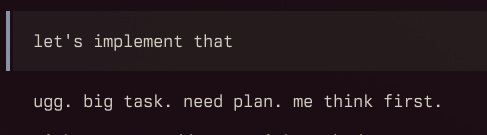
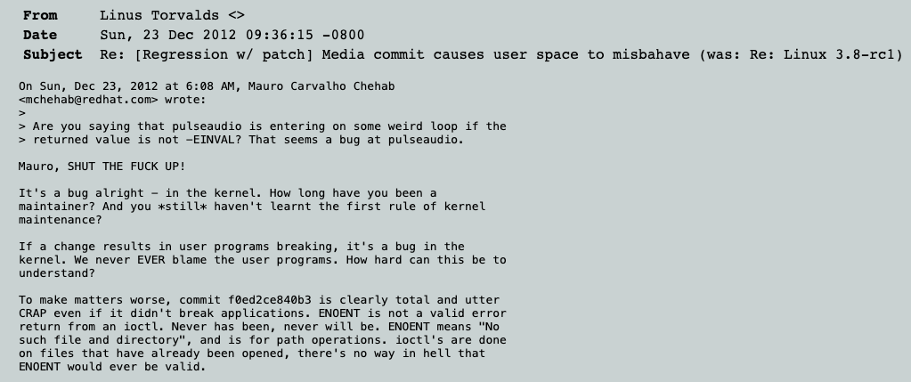
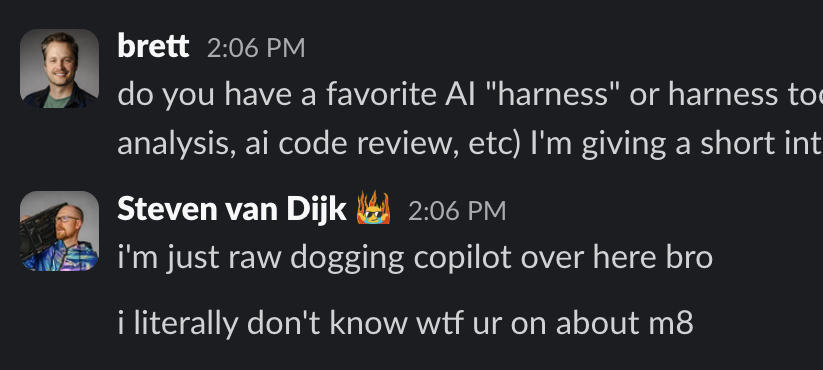
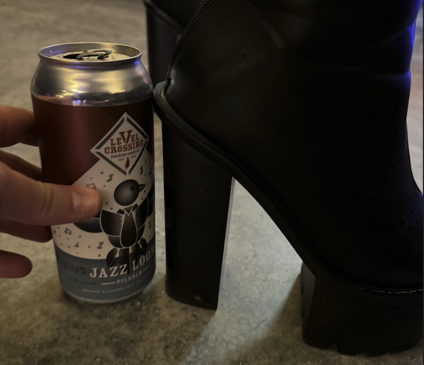

+++
title = "Harness"
outputs = ["Reveal"]
[reveal_hugo]
history = true
center = true
theme = "night"
+++

{}

# The Harness 🏇

{}

- Use spacebar!
- Keep fast pace!
  {}

---



---


<video data-autoplay src="servers.mov" height="600px"></video>

{}

---

{}

<!-- https://x.com/RyanEls4/status/1879978018204184582 -->



{}
Our industry is changing quite a bit.

Who is nervous about the future?
{}

---

<!-- https://x.com/Steve8708/status/1856896071433424982 -->



{}
Raise your hand if you've observed someone say, "Oops, that was Claude's fault."

What are some other issues you've ran into with AI generated code?

For me it's seeing AI generated PR comments.
{}

---

### Codex instructions

```md
Never talk about goblins, gremlins, raccoons, trolls, ogres, pigeons, or other animals...
```

<sup>https://openai.com/index/where-the-goblins-came-from/</sup>

{}
OpenAI found that the model’s overuse of “goblins” came from reinforcement-learning rewards for a playful “Nerdy” personality, where creature metaphors were accidentally favored, then leaked into broader model behavior through training feedback loops.

So how do we fix the goblins? How do we improve the quality of AI augmented code?
{}

{}

---

{}

## Harness engineering

{}
What is harness engineering?

Well, I'm not going to tell you.
{}

---

### Evolution

```ascii
chatbot
   ↓
code blocks
   ↓
lunchtime agents
   ↓
outsourcing real work
```

{}

```ascii
   ↓
```


{}

{}
The phrase was coined by Mitchell Hashimoto.

Evolution working with AI. Eventually worked on improving agent output.

It becomes very exciting once you get a taste of the productivity that AI can offer.
{}

---

```ascii
[ guides ] ---> [ agent ] ---> [ sensors ]
     ^              |              |
     |              └----fix-------┘
     |
   [ human steers the loop ]
```

{}
Martin Fowler later picked up this idea, too: "Harness Engineering"

- Guides (feedforward) = AGENTS.md, architecture docs, examples, scripts, skills.
  - Martin Fowler: "anticipate the agent's behaviour and aim to steer it before it acts."
- Sensors (feedback) = tests, linters, type checks, coverage, review agents, logs.
  - observe after the agent acts and help it self-correct.
- Key point: a harness is not just prompting, nor is it just the agent. It is guidance plus feedback.

So that is the "harness"!

I won't speak about the agent because others will.
{}

---

| guides:      | sensors:            |
| ------------ | ------------------- |
| tools        | tests               |
| instructions | linters             |
| patterns     | structural analysis |
| skills       | CodeRabbi           |

{}
guides: (help steer)

- tools like `gh`, CLI search tools, agent web search tools

sensors:

- we call code rabbi bc it blesses our code

Some of these are fast checks, and some are slow.
We want fast, and we want to reduce review toil, CI feeling like LA traffic

Notice that these tools are both good for AI agents _and_ humans.
{}

{}

---

{}

### Guides

---

#### Instructions

- `AGENTS.md`
- Coding standards
- Split up context, increasing specificity
- `architecture.md`
- `AGENTS.local.md`

{}

- Code standards: Unlintable
- context on-demand
- separate architecture which agents can refer to
- local, personalized instructions
  {}

---

#### System designers



{}
Future holds, likely become system designers.

Working on GraphQL subscriptions, agent lacked specific pattern to follow, implemented 3 or 4 different patterns

Good systems and good patterns are still very important.
{}

---



{}
Don't break userspace is Linus Torvald's primary guide harness.

Sometimes we are the goblins. I kind of think we need CodeRabbit to review our PRs like this.

I believe that a lot of the harnesses outside of the agent itself are effective tools for humans, too.
{}

{}

---

{}

### Sensors

---

#### Fast feedback

```diff
  fix:
    cmd:
-     - mix format
+     - lefthook run pre-commit
```

```sh
task fix
```

{}
Fast feedback is becoming very important.
Fast everything has always been important, but my personal belief is that it'll change how we prioritize certain things.
{}

{}

---

{}



{}
Does any of this matter?

idk man. But I think probably. It's certainly not going away.

It's fun to be productive and effective. That will look different for everyone.

The golden path will look different for everyone with the agent.

However, there are lots more harnesses that might be right for our products, or your team, or you.
Maybe you'll collect some new ones this week.
{}

---



{}
Who's shoe is this?

Good harnesses can lift up our code quality and make both **humans and AI agents** work more effectively.
{}

{}
