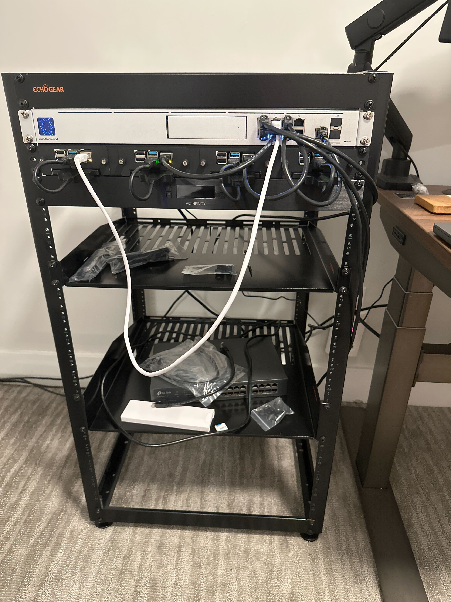

+++
title = "Homelab pics"
outputs = ["Reveal"]
[reveal_hugo]
theme = "blood"
history = true
center = true
plugins = ["/plugins/chalkboard.js"]
+++

# iSpy Homelabs

---



  Young Cody

---



  Jarem

---



  Jarem

---



  Sid

---



  Wylan

---

  Brett

---



  Clayton

---

  Michael

---



  Steven

---



  Hackerman

