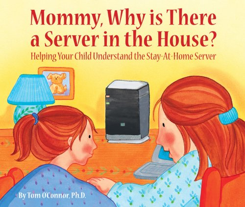
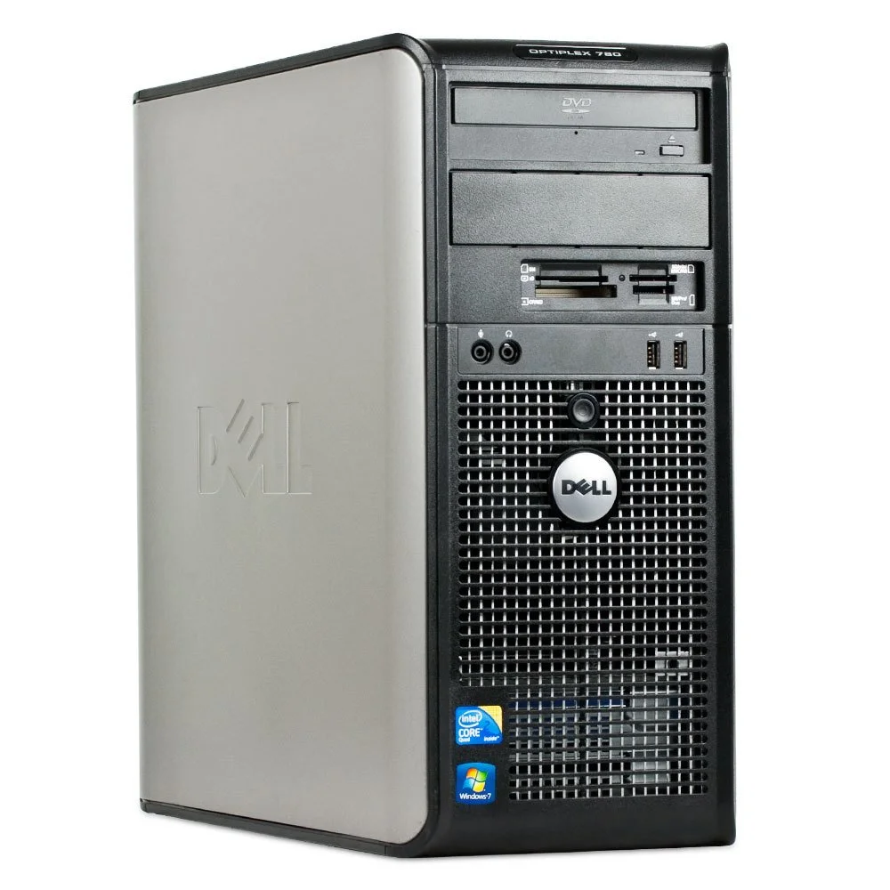
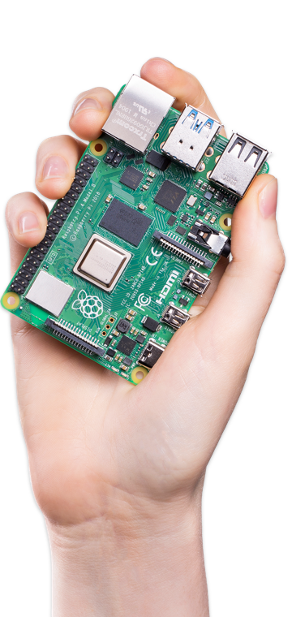
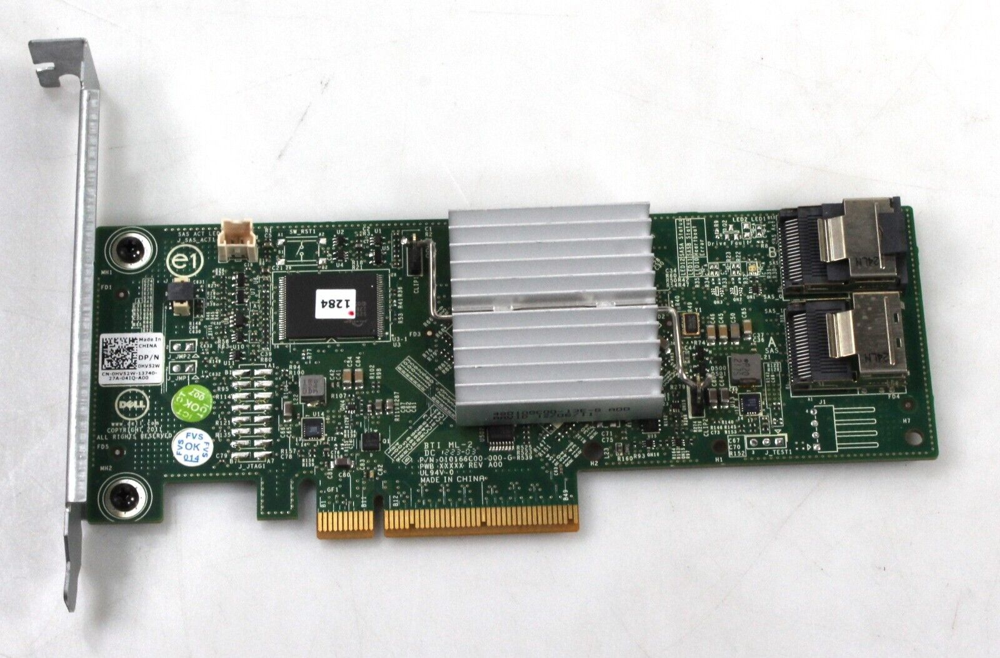
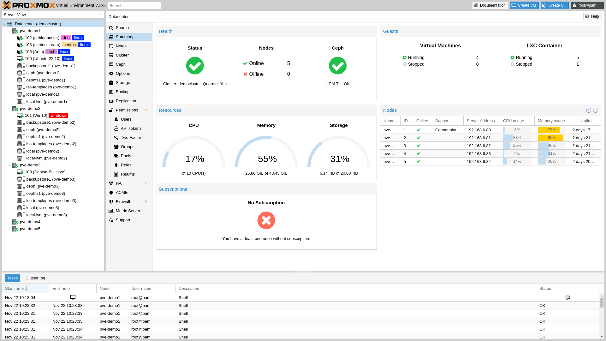
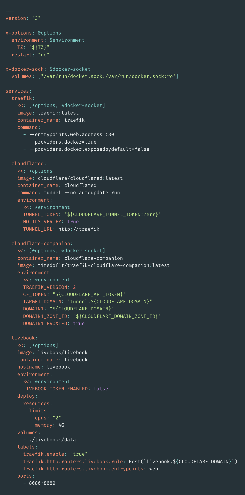

+++
title = "homelab"
outputs = ["Reveal"]
[reveal_hugo]
history = true
center = true
+++

{}

## Bare-metal servers



## in the laundry room

{} Nevermind the clickbait title, in my opinion the "Homelab" also
applies to cloud services that you run yourself.

It's hard to tailor this topic to a wide audience with a variety of experiences,
so I'll touch on various ideas and leave it up to you to explore the rest.

I really want what I present to be actionable instead of theoretical. This is
from the perspective of a hobbyist, instead of a professional, although I
believe the both support each other.

Working agreement: you can interrupt me as we go or even shout vulgarities if
you'd like. {}

---

## Poll



Who self-hosts an application _locally_?

 

Who self-hosts an application _in the cloud_?

 

Why do you do it?



---

## Demo

 [https://livebook.brett.pw](https://livebook.brett.pw) 

{}

---

{}

## Hardware

<!-- Move this to after software? -->



{}From 2009 I think? Start using it in 2015. There's veteran blood in
the room with a few of you being sysadmins - **Has anyone self-hosted on _older_
hardware than this?** {}

---



$35

{} Enough compute in the palm of your hand to make a desktop for
Grandma to run Facebook on. {}

---



---



---



---



---



- Dell Perc H310
- LSI 9211-8i IT mode (bypass hardware RAID)

{}

---

{}

<!-- Software 1. VMs/Docker, 2. docker-compose, 3. kubernetes -->

## Devops

---



---

```sh
APP=$(cat <<-END
while true; do
  echo -e 'HTTP/1.1 200 OK\n\n $(date)' | nc -l -p 3000
done
END
)
docker run --rm --name simple -p 3000:3000 busybox sh -c "$APP"
```

{}

Here is out app - We're using netcat to listen to TCP connects on a port and
reply with a _very_ simple HTTP response.

<!-- Add note about what Docker is doing -->

{}

---



[brettinternet/docker-compose-hosted-demo](https://github.com/brettinternet/docker-compose-hosted-demo)

---



---

Self-hosted K8s tooling

- [metallb](https://metallb.universe.tf/): bare-metal service
LoadBalancer

- [Flux](https://fluxcd.io/flux/): gitops

- [sops](https://github.com/mozilla/sops): secrets in git

- [reloader](https://github.com/stakater/Reloader): upgrade pod when
config/secret changes



- [system-upgrade-controller](https://github.com/rancher/system-upgrade-controller):
  planned node upgrades

- [kured](https://github.com/kubereboot/kured): reboot daemon



Starting point: https://github.com/onedr0p/flux-cluster-template

[k8s@home Discord](https://k8s-at-home.com/)



{}

---

{}

<!-- There's an app for that - showcase self-hosted applications -->



---

#### Some Apps

- [OPNsense](https://opnsense.org/about/about-opnsense/): firewall and
router

- [Document management](https://github.com/paperless-ngx/paperless-ngx)
([Demo](https://demo.paperless-ngx.com/accounts/login/?next=/)): document
archive

- [Folding@home](https://foldingathome.org/diseases/?lng=en): protein
simulations

- [Miniflux](https://miniflux.app/): simple RSS reader

- [AdGuard Home](https://miniflux.app/) or
[Pi-hole](https://pi-hole.net/): DNS proxy
([FBI warning](https://www.ic3.gov/Media/Y2022/PSA221221?=8324278624))

- [Plex](https://www.plex.tv): stream home media

- [ntfy](https://ntfy.sh) ([Demo](https://ntfy.sh/app)): pubsub push
notifications

- [Home Assistant](https://www.home-assistant.io)
([Demo](https://demo.home-assistant.io/)): home automation

---

### Home Assistant



---



{}

---

{}

## Resources

- [awesome-selfhosted](https://github.com/awesome-selfhosted/awesome-selfhosted)
- Subreddits: [selfhosted](https://www.reddit.com/r/selfhosted/),
  [homelab](https://www.reddit.com/r/homelab/),
  [DataHoarder](https://www.reddit.com/r/DataHoarder/)
- [Privacy Guides](https://www.privacyguides.org/)
  ([PrivacyToolsIO subreddit](https://www.reddit.com/r/privacytoolsIO/))

---

## Thank you to our sponsors


[The NetMan Shop](https://netmanshop.com/)

---

[Homelab pics](../homelab-pics)

{}
