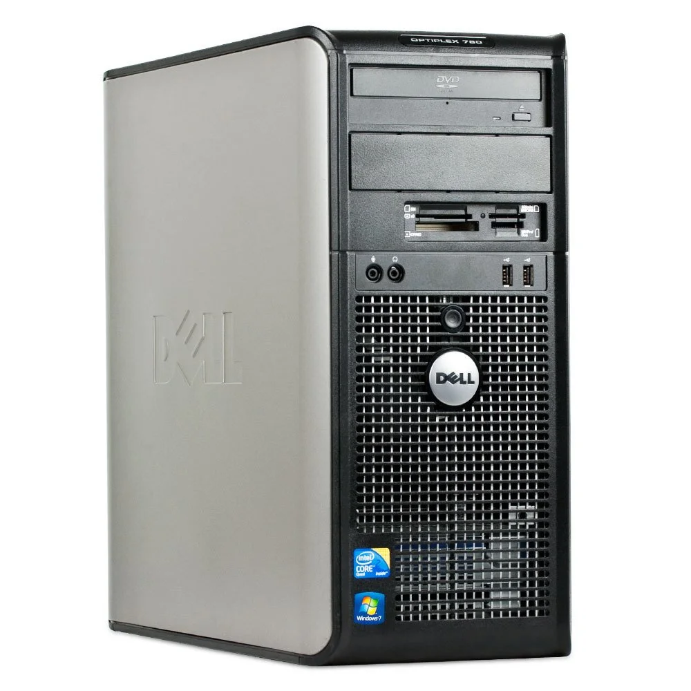
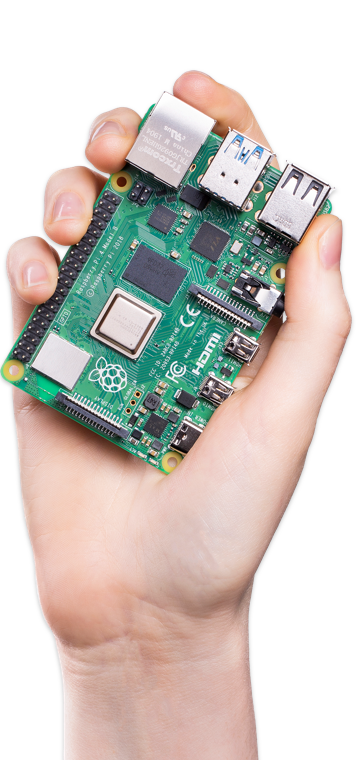
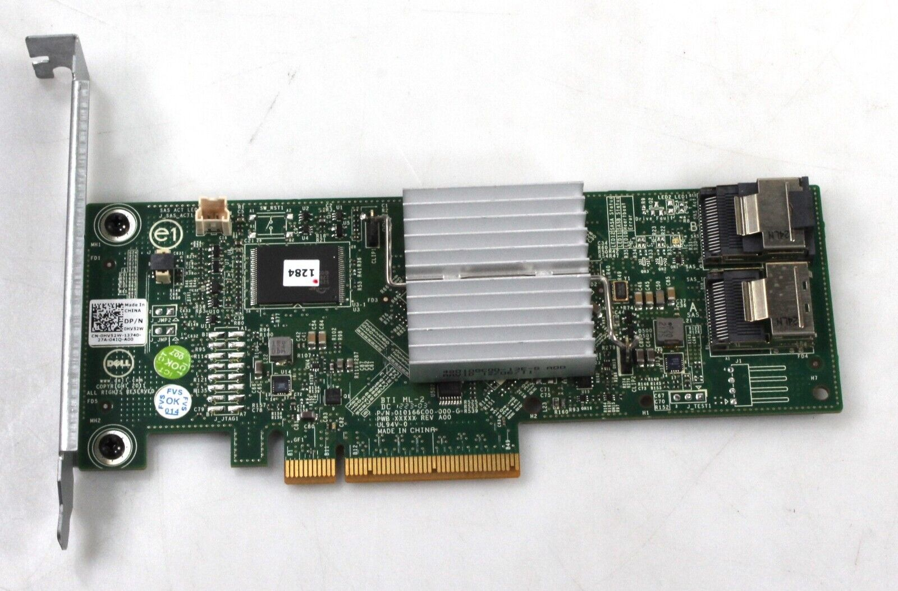

+++
title = "Self-hosted"
outputs = ["Reveal"]
[reveal_hugo]
history = true
center = true
plugins = ["plugins/chalkboard.js"]
+++

{}

## Bare-metal servers


## in the laundry room

{} Nevermind the clickbait title, in my opinion the "Homelab" also
applies to cloud services that you run yourself. {}

---

<!-- Poll -->

### Resources & Questions

[https://go.gardiner.cloud/mural](https://app.mural.co/t/pdq3587/m/pdq3587/1672788287090/6eb4baca62fcbe958507dab73b33f88a28279404?sender=a8ff14a1-7a4c-4610-9ecf-4c2add6f713f)



#### Who self-hosts an application _locally_?

 

#### Who self-hosts an application _in the cloud_?

 

#### Why is this relevant?



---

<!-- About -->

### Hardware

<!-- Move this to after software? -->



{}From 2009 I think? Start using it in 2015. There's veteran blood in
the room with a few of you being sysadmins - **Has anyone self-hosted on _older_
hardware than this?** {}

---





$35

{} Enough compute in the palm of your hand to make a desktop for
Grandma to run Facebook on. {}

---



---



---



---



---



- Dell Perc H310
- LSI 9211-8i IT mode (bypass hardware RAID)

{}

---

{}

<!-- Software 1. Simple, 2. Good, 3. Bad -->

### Simple Example



```sh
APP=$(cat <<-END
while true; do
  echo -e 'HTTP/1.1 200 OK\n\n $(date)' | nc -l -p 3000
done
END
)
docker run --rm --name simple -p 3000:3000 busybox sh -c "$APP"
```



{}

Here is out app - We're using netcat to listen to TCP connects on a port and
reply with a _very_ simple HTTP response.

<!-- Add note about what Docker is doing -->

{}

{}

---

{}

## Good Example

{}

{}

## Bad Example



{}

{}

<!-- There's an app for that - showcase self-hosted applications -->



---

#### Some Apps

- [Document management](https://github.com/paperless-ngx/paperless-ngx)
([Demo](https://demo.paperless-ngx.com/accounts/login/?next=/)): document
archive

- [Miniflux](https://miniflux.app/): simple RSS reader

- [AdGuard Home](https://miniflux.app/) or
[Pi-hole](https://pi-hole.net/): DNS proxy
([FBI warning](https://www.ic3.gov/Media/Y2022/PSA221221?=8324278624))

- [OPNsense](https://opnsense.org/about/about-opnsense/): firewall and
router

- [Plex](https://www.plex.tv): stream home media

- [Home Assistant](https://www.home-assistant.io)
([Demo](https://demo.home-assistant.io/)): home automation

---

### Home Assistant



---



{}

---

{}

## Resources

- [awesome-selfhosted](https://github.com/awesome-selfhosted/awesome-selfhosted)
- Subreddits: [selfhosted](https://www.reddit.com/r/selfhosted/),
  [homelab](https://www.reddit.com/r/homelab/),
  [DataHoarder](https://www.reddit.com/r/DataHoarder/)
- [Privacy Guides](https://www.privacyguides.org/)
  ([PrivacyToolsIO subreddit](https://www.reddit.com/r/privacytoolsIO/))
- [Homelab slideshow](../homelabs)
- [PDQ Homelab Mural](https://go.gardiner.cloud/mural)

---

## Thank you to our sponsors


[The NetMan Shop](https://netmanshop.com/)

{}
